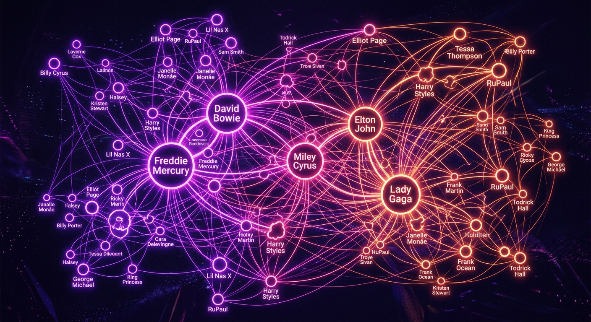

# Queer Icons Network

**Queer Icons Network** je interaktivna web aplikacija dizajnirana za istraživanje i vizualizaciju bogate povijesti i suvremenog utjecaja queer ikona u popularnoj kulturi. Koristeći naprednu mrežnu grafiku, aplikacija prikazuje kako su legende poput Marshe P. Johnson, Freddieja Mercuryja i Lady Gage međusobno povezane kroz inspiraciju, suradnju i zajedničku borbu za vidljivost.

## Ključne Značajke

- **Interaktivna Mreža (Graph):** Dinamički vizualni prikaz povezanosti ikona koristeći D3.js. Povucite čvorove, zumirajte i istražite klastere utjecaja.
- **Duboki Uvid:** Detaljni opisi svake ikone na hrvatskom jeziku, generirani uz pomoć Gemini AI tehnologije.
- **Kulturna Taksonomija:** Ikone su kategorizirane prema domenama djelovanja: Glazba, Aktivizam, Drag, Umjetnost i Film/TV.
- **Artistički Dizajn:** Moderni "Artistic Flair" dizajn s tamnom temom i vibrantnim neon akcentima.

## Tehnologije

- **Frontend:** React 18, Vite, Tailwind CSS 4.
- **Vizualizacija:** D3.js (Force-directed graph).
- **Animacije:** Motion (framer-motion).
- **AI:** Google Gemini API za generiranje sadržaja i logike povezivanja.
- **Backend:** Node.js / Express server.
- **Baza podataka:** Firebase Firestore (uskoro integrirano za korisničke doprinose).

## Kako koristiti

1. **Istražite Graf:** Koristite miš za pomicanje i zoom.
2. **Kliknite na Čvor:** Odaberite ikonu da biste otvorili bočni panel s detaljnim informacijama.
3. **Povežite se:** Pogledajte specifične razloge zašto je jedna ikona povezana s drugom.

---
*Ovaj projekt je stvoren kao posveta svima koji su hrabro koračali ispred svog vremena.*
