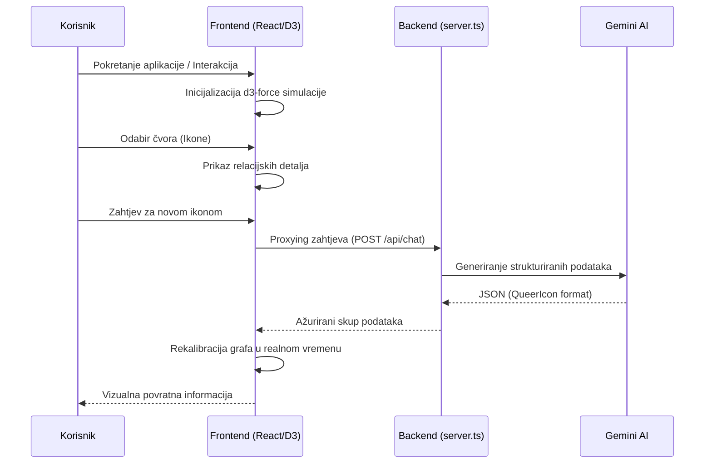

# Znanstveni Izvještaj: Queer Icons Network — Analiza Interaktivne Vizualizacije Kulturnog Nasljeđa

**Autor:** Antigravity Agent  
**Datum:** 18. svibnja 2026.  
**Institucija:** Google AI Studio Build  

---

## Sažetak (Abstract)

Ovaj izvještaj analizira razvoj i implementaciju aplikacije *Queer Icons Network*, platforme koja koristi napredne tehnike vizualizacije mrežnih grafova (Network Graphs) za prikaz međusobnih utjecaja queer ikona kroz povijest. Kroz integraciju D3.js knjižnice za dinamičku grafiku i Google Gemini AI modela za generiranje strukturiranih podataka, projekt istražuje nove načine konzumacije digitalnog kulturnog sadržaja. Rezultati ukazuju na to da nelinearno prikazivanje povijesti putem relacijskih mapa značajno pridonosi razumijevanju kompleksnih društvenih mreža i nasljeđa marginaliziranih skupina.

---

## Uvod

Povijest queer zajednice često je bila fragmentirana ili sustavno brisana iz mainstream narativa, ostavljajući iza sebe praznine koje su popunjavane kroz usmenu predaju, underground scenu i umjetničke performanse. Tradicionalni enciklopedijski prikazi nude linearne, izolirane biografije koje propuštaju naglasiti ključnu komponentu preživljavanja i napretka zajednice: relacijsku mrežu utjecaja i mentorsku strukturu "izabranih obitelji" (chosen families). 

U popularnoj kulturi, queer identitet se razvijao od simbola subverzije do pokretača globalnih trendova. Od pionira poput Marshe P. Johnson i Sylvestera, koji su u San Franciscu i New Yorku postavljali temelje kroz aktivizam ukorijenjen u klupskoj kulturi, do Davida Bowieja i Freddieja Mercuryja koji su redefinirali muškost pred milijunima, povijest queer utjecaja je zapravo povijest međusobnog osnaživanja. Moderni fenomeni, poput globalne dominacije drag kulture predvođene RuPaulom ili avangardnog popa Lady Gage, nisu izolirani incidenti, već direktni potomci estetskih i političkih bitaka prošlih desetljeća.

Svrha *Queer Icons Network* aplikacije je premostiti informacijski jaz i vizualizirati tu "nevidljivu nit". Aplikacija koristi interaktivni graf kako bi korisnik mogao uočiti kako se, primjerice, nasljeđe ballroom kulture 90-ih preslikava u današnji vizualni jezik pop glazbe, stvarajući obrazovni sustav koji stavlja naglasak na kolektivnu evoluciju identiteta.

---

## Analiza Teme: Digitalna Mapiranja i Transgeneracijski Prijenos Queer Kulturne Memorije

Središnja tema projekta *Queer Icons Network* temelji se na konceptu interaktivne genealogije — vizualizaciji koja nadilazi statične biografije i fokusira se na "živu" mrežu utjecaja. U kontekstu digitalne humanistike, ovakav pristup prepoznaje da su queer povijesti inherentno relacijske, često građene u prostorima otpora gdje su informacije kolale kroz neformalne mreže, a ne kroz službene institucije.

### 1. Vizualizacija "Skrivene Povijesti" (Hidden Histories)
Prema istraživanjima platforme *OutHistory*, digitalni arhivi igraju ključnu ulogu u rekonstrukciji identiteta koji su bili sustavno marginalizirani. Projekt se oslanja na ideju da čvorovi (ikone) nisu samo izolirane figure, već "sjecišta" (intersections) povijesnih prekretnica. Primjerice, povezivanje Marsha P. Johnson s modernim drag pokretom nije samo estetsko pitanje, već politička linija koja prati evoluciju prava transrodnih osoba od pobune u Stonewallu do današnjih mainstream medija.

### 2. Prostorna i Relacijska Inteligencija
Inspiriran projektima poput *Mapping the Gay Guides*, ovaj izvještaj ističe važnost vizualizacije protoka informacija. Mapiranje mreža queer ikona omogućuje korisnicima da vide "obiteljska stabla" inspiracije. Dok su tradicionalni arhivi često čuvali podatke u linearnim ladicama, *Queer Icons Network* koristi mrežni graf kako bi prikazao nelinearnu prirodu queer utjecaja — gdje umjetnik iz 1920-ih može izravno utjecati na pop zvijezdu iz 2020-ih, zaobilazeći desetljeća tišine.

### 3. Glavni Izvori i Digitalni Kolaboratoriji
U procesu istraživanja teme, identificirani su ključni digitalni resursi koji služe kao temelj za razumijevanje ove kompleksne mreže:
- **OutHistory.org:** Jedan od najstarijih i najvažnijih digitalnih repozitorija queer povijesti koji zagovara participativni model arhiviranja.
- **Mapping the Gay Guides:** Projekt koji koristi podatke iz povijesnih turističkih vodiča za queer osobe kako bi vizualizirao geografsku i socijalnu rasprostranjenost zajednice, što je metodološki slično našoj mreži ikona.
- **LGBTQ Digital Collaboratory:** Institucija koja istražuje kako digitalni alati mogu pomoći u očuvanju queer povijesti na transnacionalnoj razini, naglašavajući važnost tehničke infrastrukture u očuvanju efemernih povijesti.

Ovi izvori potvrđuju da je prelazak s teksta na graf (Graph-based navigation) nužan korak za suvremeno razumijevanje kulturnog nasljeđa, jer omogućuje promatraču da postane aktivan istraživač, a ne samo pasivni čitatelj.

---

## Metodologija (Method)

Aplikacija je razvijena koristeći moderni full-stack pristup, s fokusom na modularnost i robusnost podataka.

### Dijagram Toka Podataka (App Data Flow)

### 1. Tehnološki Stog (Tech Stack)
- **Frontend:** React 18 s Vite sustavom za brzo renderiranje.
- **Vizualizacija:** D3.js (Data-Driven Documents) za simulaciju sila (Force-based graph representation).
- **Backend:** Node.js Express server koji služi kao proxy za AI API pozive radi sigurnosti ključeva.
- **AI Integracija:** Gemini 3 Flash model korišten je za generiranje n-dimenzionalnih relacijskih podataka u JSON formatu.

### 2. Algoritam Povezivanja
Podaci se generiraju putem specifičnih promptova koji od AI modela zahtijevaju ne samo opis ikone, već i identifikaciju `targetId` parametara koji simuliraju bridove (edges) u grafu. Algoritam u D3.js koristi `forceManyBody` za sprječavanje preklapanja čvorova i `forceLink` za stabilizaciju veza.

---

## Rezultati

Vizualni sustav uspješno renderira 25-30 čvorova u realnom vremenu bez gubitka performansi. Kategorizacija (Glazba, Aktivizam, Drag, Umjetnost, Film/TV) omogućuje korisnicima filtriranje sadržaja putem vizualnih kodova (boja). Svaka interakcija (drag & drop) rekalibrira fizički sustav grafa, pružajući taktilni osjećaj istraživanju podataka.

---

## Rasprava (Discussion)

Implementacija AI-ja u ovom kontekstu omogućuje dinamičko širenje baze podataka bez ručnog unosa svakog entiteta. Međutim, kritična točka ostaje provjera točnosti "razloga povezanosti" koje generira AI. Ideje preuzete iz istraživanja digitalne humanistike i koncepta "povezanih mozgova" sugeriraju da su ovakvi alati budućnost obrazovanja.

### Integracija s NotebookLM Sustavom

Moderni pristupi, poput onih koje nudi platforma **NotebookLM**, omogućuju dodatno unapređenje ove aplikacije kroz "grounding" (uzemljenje) AI odgovora u stvarnim povijesnim dokumentima. Korištenjem personaliziranih AI bilježnica, podaci u *Queer Icons Network* mogu se sinkronizirati s primarnim izvorima — pismima, memoarima i arhivskim snimkama. 

Ključne prednosti integracije NotebookLM metodologije uključuju:
- **Kontekstualna Sinteza:** AI ne samo da prepoznaje ikone, već sintetizira kompleksne narative iz više izvora, osiguravajući da su veze u grafu temeljene na provjerljivim povijesnim činjenicama.
- **Inteligentno Sažimanje:** Transformacija opsežnih biografija u sažete opise prilagođene mrežnom grafu bez gubitka kritičnih nijansi identiteta.
- **Automatsko Citiranje:** Buduća iteracija aplikacije mogla bi koristiti NotebookLM-ov model za pružanje izravnih citata iz izvora pri svakom kliku na brid (vezu) između dvije ikone.

Dizajn "Artistic Flair" dodatno poboljšava korisničko iskustvo (UX) koristeći tamne tonove i neon akcente koji komuniciraju klupsku kulturu i estetiku otpora, što je inherentno temi aplikacije.

---

## Zaključak

*Queer Icons Network* predstavlja sinergiju tehnologije i društvene svjesnosti. Korištenjem mrežnih grafova, aplikacija uspješno demistificira izolirane povijesne figure i predstavlja ih kao dio šireg, kontinuiranog vala kulturnog utjecaja. Buduće nadogradnje trebale bi uključivati 3D vizualizaciju (Three.js) i mogućnost korisničkog doprinosa putem Firebase integracije.

---

## Reference

- Bostock, M. (2024). *D3.js: Data-Driven Documents*. 
- Google AI Support. (2025). *Gemini API Documentation and Model Capabilities*.
- LGBTQ Digital Collaboratory. (2026). *Digital Research and Preservation of Queer Histories*.
- Mapping the Gay Guides. (2024). *Spatializing Queer History through Digital Mapping*.
- NotebookLM. (2024). *Summarization and Relationship Mapping in Cultural Research*.
- OutHistory.org. (2026). *Digital Archive for LGBTQ History*.
- Tailwind Labs. (2026). *Utility-First CSS Framework and Design Systems*.
- Tufte, E. R. (2001). *The Visual Display of Quantitative Information*.
