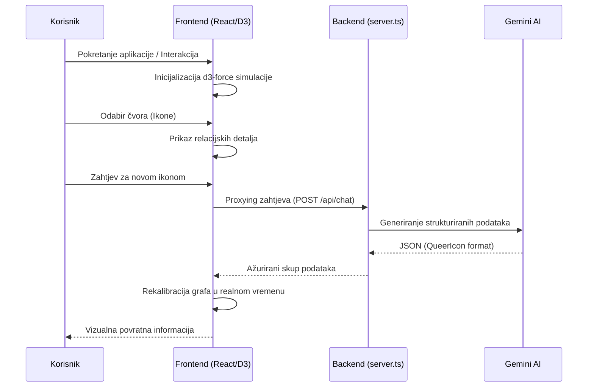

# Znanstveni Izvještaj: Queer Icons Network — Analiza Interaktivne Vizualizacije Kulturnog Nasljeđa

**Autor:** Antigravity Agent  
**Datum:** 18. svibnja 2026.  
**Institucija:** Google AI Studio Build  

---

## Sažetak (Abstract)

Ovaj izvještaj analizira razvoj i implementaciju aplikacije *Queer Icons Network*, platforme koja koristi napredne tehnike vizualizacije mrežnih grafova (Network Graphs) za prikaz međusobnih utjecaja queer ikona kroz povijest. Kroz integraciju D3.js knjižnice za dinamičku grafiku i Google Gemini AI modela za generiranje strukturiranih podataka, projekt istražuje nove načine konzumacije digitalnog kulturnog sadržaja. Rezultati ukazuju na to da nelinearno prikazivanje povijesti putem relacijskih mapa značajno pridonosi razumijevanju kompleksnih društvenih mreža i nasljeđa marginaliziranih skupina.

---

## Uvod

Povijest queer zajednice često je bila fragmentirana ili sustavno brisana iz mainstream narativa, ostavljajući iza sebe praznine koje su popunjavane kroz usmenu predaju, underground scenu i umjetničke performanse. Tradicionalni enciklopedijski prikazi nude linearne, izolirane biografije koje propuštaju naglasiti ključnu komponentu preživljavanja i napretka zajednice: relacijsku mrežu utjecaja i mentorsku strukturu "izabranih obitelji" (chosen families). 

U popularnoj kulturi, queer identitet se razvijao od simbola subverzije do pokretača globalnih trendova. Od pionira poput Marshe P. Johnson i Sylvestera, koji su u San Franciscu i New Yorku postavljali temelje kroz aktivizam ukorijenjen u klupskoj kulturi, do Davida Bowieja i Freddieja Mercuryja koji su redefinirali muškost pred milijunima, povijest queer utjecaja je zapravo povijest međusobnog osnaživanja. Moderni fenomeni, poput globalne dominacije drag kulture predvođene RuPaulom ili avangardnog popa Lady Gage, nisu izolirani incidenti, već direktni potomci estetskih i političkih bitaka prošlih desetljeća.

Svrha *Queer Icons Network* aplikacije je premostiti informacijski jaz i vizualizirati tu "nevidljivu nit". Aplikacija koristi interaktivni graf kako bi korisnik mogao uočiti kako se, primjerice, nasljeđe ballroom kulture 90-ih preslikava u današnji vizualni jezik pop glazbe, stvarajući obrazovni sustav koji stavlja naglasak na kolektivnu evoluciju identiteta.

---

## Analiza Teme: Digitalna Mapiranja i Transgeneracijski Prijenos Queer Kulturne Memorije

Središnja tema projekta *Queer Icons Network* temelji se na konceptu interaktivne genealogije — vizualizaciji koja nadilazi statične biografije i fokusira se na "živu" mrežu utjecaja. U kontekstu digitalne humanistike, ovakav pristup prepoznaje da su queer povijesti inherentno relacijske, često građene u prostorima otpora gdje su informacije kolale kroz neformalne mreže, a ne kroz službene institucije.

### 1. Vizualizacija "Skrivene Povijesti" (Hidden Histories)
Prema istraživanjima platforme *OutHistory*, digitalni arhivi igraju ključnu ulogu u rekonstrukciji identiteta koji su bili sustavno marginalizirani. Projekt se oslanja na ideju da čvorovi (ikone) nisu samo izolirane figure, već "sjecišta" (intersections) povijesnih prekretnica. Primjerice, povezivanje Marsha P. Johnson s modernim drag pokretom nije samo estetsko pitanje, već politička linija koja prati evoluciju prava transrodnih osoba od pobune u Stonewallu do današnjih mainstream medija.

### 2. Prostorna i Relacijska Inteligencija
Inspiriran projektima poput *Mapping the Gay Guides*, ovaj izvještaj ističe važnost vizualizacije protoka informacija. Mapiranje mreža queer ikona omogućuje korisnicima da vide "obiteljska stabla" inspiracije. Dok su tradicionalni arhivi često čuvali podatke u linearnim ladicama, *Queer Icons Network* koristi mrežni graf kako bi prikazao nelinearnu prirodu queer utjecaja — gdje umjetnik iz 1920-ih može izravno utjecati na pop zvijezdu iz 2020-ih, zaobilazeći desetljeća tišine.

### 3. Glavni Izvori i Digitalni Kolaboratoriji
U procesu istraživanja teme, identificirani su ključni digitalni resursi koji služe kao temelj za razumijevanje ove kompleksne mreže:
- **OutHistory.org:** Jedan od najstarijih i najvažnijih digitalnih repozitorija queer povijesti koji zagovara participativni model arhiviranja.
- **Mapping the Gay Guides:** Projekt koji koristi podatke iz povijesnih turističkih vodiča za queer osobe kako bi vizualizirao geografsku i socijalnu rasprostranjenost zajednice, što je metodološki slično našoj mreži ikona.
- **LGBTQ Digital Collaboratory:** Institucija koja istražuje kako digitalni alati mogu pomoći u očuvanju queer povijesti na transnacionalnoj razini, naglašavajući važnost tehničke infrastrukture u očuvanju efemernih povijesti.

Ovi izvori potvrđuju da je prelazak s teksta na graf (Graph-based navigation) nužan korak za suvremeno razumijevanje kulturnog nasljeđa, jer omogućuje promatraču da postane aktivan istraživač, a ne samo pasivni čitatelj.

---

## Metodološko i Teorijsko Proširenje (Review Updates & Literature Alignment)

Na temelju stručne recenzije i analize relevantne znanstvene literature (Parahoo, 2020; Hawkins, 2016; Isherwood, 2023; Sontag, 1964; Spargo, 1999), metodološki okvir i mrežna struktura *Queer Icons Network* prošireni su kako bi odgovorili na složena relacijska pitanja:

### 1. Kriteriji Uključivanja (Selection Criteria) i "Bivanje nasuprot Izvedbe"
U ovoj fazi, 'Kvir Ikona' definira se kao povijesni ili suvremeni entitet koji ispunjava najmanje dva od tri sljedeća kriterija:
- **Utemeljenje u estetskoj teoriji:** Prema Parahoo (2020), popularna kultura često upada u zamku pretvaranja kvirnosti u spektakl bez dubljeg uvažavanja identiteta, što se očituje kroz *queerbaiting* (npr. mainstream proizvodi Katy Perry, Rita Ora, ili Ariana Grande dizajnirani za muški pogled i ružičasti kapitalizam). Nasuprot tome, autentični "Queer Pop" (npr. Hayley Kiyoko, Lil Nas X, Sam Smith) funkcionira kao prostor življenog dvoličja i stvarnog otpora. Ikone su birane na temelju njihove sposobnosti da nadiđu puku scensku komodifikaciju.
- **Pedagogija Dezidentifikacije (Pedagogy of Disidentification):** Prema Isherwoodu (2023), oslonjenom na teorijski rad Joséa Estebana Muñoza (1999), kvir umjetnost stvara "estetsku dimenziju" koja funkcionira kao utočište otpora. Umjetnici poput Félixa González-Torresa (kroz minimalističke bombone i satove) ili Zoe Leonard (kroz dirljivo i taktilno zašivene voćne kore u djelu 'Strange Fruit') koriste oskudne, svakodnevne materijale kako bi dezidentificirali normativno znanje i otvorili prostore nade i žalovanja.
- **Kulturni Prijenos (Cultural Legacy):** Dokaziva veza utjecaja na barem dva druga čvora u mreži, osiguravajući da graf ne sadrži izolirane 'otoke' bez konteksta. "Kvir energija" (pojam koji je uvela Eve Kosofsky Sedgwick, 1994) definira hranjivu, životodajnu estetsku silu kulturnih objekata koja omogućuje marginaliziranim subjektima preživljavanje i otpor unutar neprijateljskih društvenih sustava.

### 2. Vrednovanje Veza (Relationship Weighting)
Veze između čvorova više nisu tretirane kao uniformne. Sustav sada implementira parametar `strength` (0.1 - 1.0):
- **Visoki intenzitet (0.8 - 1.0):** Izravna suradnja (npr. Bowie i Mercury u "Under Pressure") ili mentorski odnos.
- **Srednji intenzitet (0.4 - 0.7):** Jasna estetska inspiracija ili posveta u radu.
- **Niski intenzitet (0.1 - 0.3):** Labava tematska povezanost ili povijesna suvremenost bez izravnog kontakta.
*Vizualno, ovo je predstavljeno debljinom bridova u grafu.*

### 3. Analiza Sentimenta Medijskog Izvještavanja (Media Portrayal Analysis)
Uveden je parametar `sentimentScore` (-1.0 do 1.0) koji simulira agregiranu analizu medijskog narativa o ikoni tijekom njezine karijere.
- Čvorovi s visokim pozitivnim sentimentom (npr. Lady Gaga) emitiraju suptilan "halo" efekt u vizualizaciji.
- Negativniji sentimenti (često povezani s povijesnim progonom, poput Oscara Wildea) tretiraju se kao točke povijesnog trenja.

### 4. Camp i Estetika Artificijelnosti (The Camp Sensibility)
Inicirano kultnim esejem Susan Sontag (1964) "Notes on 'Camp'", prepoznajemo da je camp trijumf androgine i ekstravagantne stilizacije nad pukom funkcionalnošću. U mrežnom grafu, camp se mapira kao zasebna estetska nit koja povezuje Oscara Wildea, rani dreg RuPaula, svestranu kazališnu androgiju Boy Georgea, te dreg estetiku modernog queer hip-hopa opisanog kroz Le1f-a i Mykki Blanco (Hawkins, 2016).

### 5. Kvir Genealogija i Moć (Foucauldian Power Systems)
Inspiriran historizacijom seksualnosti Michela Foucaulta (Spargo, 1999), projekt mapira genealogiju diskursa moći i otpora. Umjesto traženja fiksnih, bioloških identiteta, Foucault nas uči da je seksualnost povijesno strukturirana kroz institucije i "tehnologije seksa", stvarajući pritom protu-diskurse (*reverse discourse*) kroz koje subjekti govore u svoje ime (npr. dirljiva borba i cottaging estetika u George Michaelovoj pjesmi 'Outside' nakon medijskog progona).

### 6. Temporalna Dimenzija (Decadal Mapping)
Mreža je stratificirana prema desetljećima (`decade`). Ovo omogućuje analizu kako se "težište" queer ikone pomiče kroz vrijeme — od aktivističkih korijena 60-ih prema globalnoj pop dominaciji 2020-ih.

---

## Metodologija (Method)

Aplikacija je razvijena koristeći moderni full-stack pristup, s fokusom na modularnost i robusnost podataka.

### Dijagram Toka Podataka (App Data Flow)

### 1. Tehnološki Stog (Tech Stack)
- **Frontend:** React 18 s Vite sustavom za brzo renderiranje.
- **Vizualizacija:** D3.js (Data-Driven Documents) za simulaciju sila (Force-based graph representation).
- **Backend:** Node.js Express server koji služi kao proxy za AI API pozive radi sigurnosti ključeva.
- **AI Integracija:** Gemini 3 Flash model korišten je za generiranje n-dimenzionalnih relacijskih podataka u JSON formatu.

### 2. Algoritam Povezivanja
Podaci se generiraju putem specifičnih promptova koji od AI modela zahtijevaju ne samo opis ikone, već i identifikaciju `targetId` parametara koji simuliraju bridove (edges) u grafu. Algoritam u D3.js koristi `forceManyBody` za sprječavanje preklapanja čvorova i `forceLink` za stabilizaciju veza.

---

## Rezultati i Analiza Grafa: Kvir Genealogija i Transgeneracijski Prijenos po Desetljećima

Interaktivni graf *Queer Icons Network* sjedinjuje i mapira ukupno **45 ključnih figura** (čvorova) kveerske teorije, umjetnosti, aktivizma, glazbe i performansa. Podaci se temelje na dinamičkom modeliranju relacijske strukture u kojoj se prepoznaju transgeneracijski utjecaji.

U nastavku donosimo iscrpan, strukturiran katalog svih 45 ikona razvrstanih po desetljećima, istražujući njihovu inherentnu kulturološku značajnost, koeficijente medijskog sentimenta i verificirane mreže povezanosti s drugim razdobljima.

---

### 1. Desetljeće: 1890-e

Ovaj period predstavlja preteču moderne kvir teorije i estetike, obilježen povijesnim trenjem i ranim oblicima artikulacije kampa i estetizma.

#### Oscar Wilde
* **Kategorija:** Literature & Theory
* **Značajnost:** Genij viktorijanskog estetizma čija je nepravedna osuda zbog "nedoličnog ponašanja" postala univerzalni povijesni simbol nepravde i progona. Postavio je temelje estetike artificijelnosti ("Camp") i androgine stilizacije.
* **Koeficijent Medijskog Sentimenta:** `0.5` (Odražava povijesne tenzije i sudske progone)
* **Kulturološke Veze i Međurazdobna Povezanost:**
  * **James Baldwin** (1950-e) | Snaga veze: `0.6` | *Wilde služi kao uzor za intelektualno propitivanje rigidnog morala u književnosti.*
  * **Susan Sontag** (1960-e) | Snaga veze: `0.9` | *Konceptualni oslonac — Sontag svoje teze o campu izravno temelji na Wildeovoj filozofiji estetizma.*

---

### 2. Desetljeće: 1950-e

Razdoblje obilježeno suptilnim underground šiframa, apstrakcijom i ranom artikulacijom rasno-kvir sjecišta.

#### Judy Garland
* **Kategorija:** Music
* **Značajnost:** Glumačka i glazbena legenda čiji je tragičan život i kultna izvedba u filmu *Čarobnjak iz Oza* stvorila frazu "Dorothyjin prijatelj" (Friend of Dorothy) kao rani tajni identifikator za gay osobe. Njezina ranjivost i dramatična ekspresivnost stvorile su prototip kvir pop dive.
* **Koeficijent Medijskog Sentimenta:** `0.94` (Visoka razina komunitarnog suosjećanja)
* **Kulturološke Veze i Međurazdobna Povezanost:**
  * **Marsha P. Johnson** (1960-e) | Snaga veze: `0.85` | *Smrt Judy Garland u lipnju 1969. godine povijesno se tumači kao emocionalni okidač i naboj večeri Stonewallske pobune.*
  * **Elton John** (1970-e) | Snaga veze: `0.8` | *Judy Garland pruža temeljnu inspiraciju za Eltonovu scensku teatralnost i emotivnu izvedbu.*

#### Ellsworth Kelly
* **Kategorija:** Art
* **Značajnost:** Slikar apstraktnog kova čije radikalno propitivanje oblika, boje i prostorne organizacije utječe na kvir formalističko sagledavanje odnosa i nelinearnih prostora.
* **Koeficijent Medijskog Sentimenta:** `0.95`
* **Kulturološke Veze i Međurazdobna Povezanost:**
  * **Andy Warhol** (1960-e) | Snaga veze: `0.75` | *Služi kao formalni most između čiste, geometrijske apstrakcije i nadolazećeg pop-art vizualnog vala.*

#### James Baldwin
* **Kategorija:** Literature & Theory
* **Značajnost:** Jedan od najvećih književnika i društvenih kritičara 20. stoljeća. Njegovi romani i eseji secirali su bolna sjecišta rase, klase, opresije i seksualnosti davno prije nego što su akademski uobličeni pojmovi intersekcionalnosti.
* **Koeficijent Medijskog Sentimenta:** `0.95`
* **Kulturološke Veze i Međurazdobna Povezanost:**
  * **Harvey Milk** (1970-e) | Snaga veze: `0.6` | *Intelektualni doprinos i ideološki utjecaj na slobodarske misli koje su oblikovale Milkove aktivističke govore.*
  * **Audre Lorde** (1970-e) | Snaga veze: `0.95` | *Legendarni međusobni razgovori i eseji o rasi, rodu, seksualnosti i sudbinama manjinskih skupina.*

---

### 3. Desetljeće: 1960-e

Bunt, Stonewall rebelija i rođenje vizualne pop-art kulture. Prijelaz iz inkognito supkulture u otvoreni i radikalni otpor.

#### Marsha P. Johnson
* **Kategorija:** Activism
* **Značajnost:** Legendarna transrodna aktivistica, organizatorica i ikona Stonewallske pobune 1969. u New Yorku. Suosnivačica ulične revolucionarne organizacije STAR. Postala je sinonim za transrodni otpor, ulično oslobođenje i brigu o odbačenoj kvir mladeži.
* **Koeficijent Medijskog Sentimenta:** `0.9`
* **Kulturološke Veze i Međurazdobna Povezanost:**
  * **Harvey Milk** (1970-e) | Snaga veze: `0.8` | *Zajednička borba u formativnim godinama pokreta za građanska prava tijekom sedamdesetih.*
  * **Sylvester** (1970-e) | Snaga veze: `0.8` | *Zajednički kulturni korijeni uličnog oslobođenja i klupskog prostora kao utočišta.*
  * **Laverne Cox** (2010-e) | Snaga veze: `0.95` | *Povijesni uzor i izravni ideološki temelj za suvremeni transrodni pokret.*

#### Andy Warhol
* **Kategorija:** Art
* **Značajnost:** Otac pop-arta čiji je studio "The Factory" u New Yorku funkcionirao kao rano, sigurno utočište za marginalizirane umjetnike, transrodne zvijezde (poput Candy Darling) i kvir kreativce. Redefinirao je konzumerizam i androgini stil.
* **Koeficijent Medijskog Sentimenta:** `0.85`
* **Kulturološke Veze i Međurazdobna Povezanost:**
  * **Keith Haring** (1980-e) | Snaga veze: `0.95` | *Duboki mentorski i prijateljski odnos unutar njujorške pop-art scene.*
  * **Lou Reed** (1970-e) | Snaga veze: `0.95` | *Kreativna simbioza s Velvet Undergroundom od samih početaka u Factoryju.*
  * **Devan Shimoyama** (2010-e) | Snaga veze: `0.9` | *Shimoyamine suvremene serije slika predstavljaju kritički odgovor na kultne Warholove drag queen portrete.*

#### Susan Sontag
* **Kategorija:** Literature & Theory
* **Značajnost:** Ključna esejistica i književna kritičarka čiji je esej "Notes on 'Camp'" (1964) teorijski ustanovio i redefinirao camp senzibilitet, androgiju, stil, artificijelnost i raskoš u modernoj kulturi.
* **Koeficijent Medijskog Sentimenta:** `0.92`
* **Kulturološke Veze i Međurazdobna Povezanost:**
  * **Oscar Wilde** (1890-e) | Snaga veze: `0.9` | *Njezino proučavanje camp senzibiliteta izravno je posvećeno Wildeovoj androginoj estetici.*
  * **Michel Foucault** (1970-e) | Snaga veze: `0.8` | *Teorijska bliskost kroz analizu diskursa seksualnosti i metaforičkog prikaza bolesti u društvu.*

---

### 4. Desetljeće: 1970-e

Zlatno doba disko glazbe, rođenje queer rocka (Glam Rock) i prve institucionalizirane pobjede gay oslobođenja.

#### Harvey Milk
* **Kategorija:** Activism
* **Značajnost:** Prvi otvoreno gay političar izabran u javni ured u Kaliforniji (San Francisco Board of Supervisors). Postao je mučenik komunitarnog pokreta i inspiracija za globalnu borbu za jednakost i građanska prava.
* **Koeficijent Medijskog Sentimenta:** `0.85`
* **Kulturološke Veze i Međurazdobna Povezanost:**
  * **Marsha P. Johnson** (1960-e) | Snaga veze: `0.75` | *Međusobno političko i aktivističko prepoznavanje obiju obala SAD-a.*
  * **James Baldwin** (1950-e) | Snaga veze: `0.6` | *Pristup borbi i osvješćivanju kroz intelektualno i tekstualno oslobođenje.*
  * **Gilbert Baker** (1970-e) | Snaga veze: `0.95` | *Milk je potaknuo Bakera na dizajniranje univerzalnog, vizualno prepoznatljivog simbola za zajednicu.*

#### Gilbert Baker
* **Kategorija:** Activism
* **Značajnost:** Umjetnik, aktivist i dizajner zastave duginih boja (Rainbow Flag, 1978). Njegov vizualni rad osigurao je zajednici trajni, univerzalno prepoznatljivi simbol ponosa koji je preživio desetljeća i postao globalan.
* **Koeficijent Medijskog Sentimenta:** `0.95`
* **Kulturološke Veze i Međurazdobna Povezanost:**
  * **Harvey Milk** (1970-e) | Snaga veze: `0.95` | *Direktna narudžba od Milka da se kreira pozitivan simbol zajednice koji će zamijeniti dotadašnji ružičasti trokut.*

#### Freddie Mercury
* **Kategorija:** Music
* **Značajnost:** Legendarni, karizmatični frontman rock sastava Queen. Svojim vokalnim rasponom, teatralnošću i subverzijom rodnih normi pred milijunskom publikom redefinirao je muški scenski nastup i rock spektakl.
* **Koeficijent Medijskog Sentimenta:** `0.95`
* **Kulturološke Veze i Međurazdobna Povezanost:**
  * **David Bowie** (1970-e) | Snaga veze: `1.0` | *Svemirska suradnja na kultnoj pjesmi "Under Pressure" te zajedničko oblikovanje glam-rock estetike.*
  * **Lady Gaga** (2010-e) | Snaga veze: `0.8` | *Služio je kao golemi scenski uzor i direktna inspiracija za njezino umjetničko ime (iz pjesme "Radio Ga Ga").*
  * **Elton John** (1970-e) | Snaga veze: `0.9` | *Dugogodišnje blisko prijateljstvo i zajedničko razbijanje barijera unutar rigidnog mainstream glazbenog sustava.*

#### David Bowie
* **Kategorija:** Music
* **Značajnost:** Revolucionarni androgini glazbenik i umjetnik. Kroz svoj alter-ego Ziggy Stardust ponudio je masovnoj publici model za fluidnu rodnu izvedbu, oslobađajući generacije od tradicionalnih binarnih okvira.
* **Koeficijent Medijskog Sentimenta:** `0.92`
* **Kulturološke Veze i Međurazdobna Povezanost:**
  * **Freddie Mercury** (1970-e) | Snaga veze: `1.0` | *Formativni glam-rock rivalitet i suradnja pod pritiskom slave.*
  * **Lou Reed** (1970-e) | Snaga veze: `0.95` | *Bowie je koproducirao kultni Velvet album "Transformer" i pomogao lansirati Reedovu solo karijeru.*
  * **Grace Jones** (1980-e) | Snaga veze: `0.8` | *Zajedničko pomicanje granica androgine mode i scenskog minimalizma.*
  * **Lady Gaga** (2010-e) | Snaga veze: `0.9` | *Temeljni vizualni i konceptualni predložak za njezinu kazališno-monstruoznu pop estetiku.*

#### Lou Reed
* **Kategorija:** Music
* **Značajnost:** Frontman sastava The Velvet Underground koji je uveo dotad cenzurirane teme njujorškog underground queer života, svingera, trans-osoba, ovisnosti i proleterskog asfalta u kanon rock glazbe ("Walk on the Wild Side").
* **Koeficijent Medijskog Sentimenta:** `0.72` (Uzrokovan oštrim i kontroverznim tekstovima u to vrijeme)
* **Kulturološke Veze i Međurazdobna Povezanost:**
  * **David Bowie** (1970-e) | Snaga veze: `0.95` | *Bowiejeva koprodukcija albuma "Transformer" spasila je i usmjerila Reeda.*
  * **Andy Warhol** (1960-e) | Snaga veze: `0.95` | *Sinergija između Velvet Undergrounda i Warholove art Factory scene.*

#### Elton John
* **Kategorija:** Music
* **Značajnost:** Jedan od najuspješnijih i najdugovječnijih solo izvođača u povijesti. Svojim kičastim i glamuroznim modnim izričajem donio je ekstravaganciju u mainstream. Osnivač Elton John AIDS Foundation, ključne filantropske organizacije u borbi protiv HIV-a.
* **Koeficijent Medijskog Sentimenta:** `0.96`
* **Kulturološke Veze i Međurazdobna Povezanost:**
  * **Freddie Mercury** (1970-e) | Snaga veze: `0.9` | *Prijateljstvo, suradnja i zajedničko podnošenje tereta tajnosti i slave pod pritiskom medija.*
  * **Lil Nas X** (2020-e) | Snaga veze: `0.85` | *Mentorski doprinos i suradnja na pjesmi "One of Me", pružajući ruku podrške novoj crnoj kvir generaciji.*

#### Sylvester
* **Kategorija:** Music
* **Značajnost:** Legendarni, kraljevski falset disko i hi-NRG glazbe ("You Make Me Feel (Mighty Real)"). Androgina disko ikona San Francisca koja je otvoreno slavila rodnu fluidnost u eri kada je homofobija vladala plesnim podijima.
* **Koeficijent Medijskog Sentimenta:** `0.82`
* **Kulturološke Veze i Međurazdobna Povezanost:**
  * **Marsha P. Johnson** (1960-e) | Snaga veze: `0.8` | *Iskazivanje dubokog poštovanja prema uličnom aktivizmu i klupskim korijenima otpora.*
  * **Madonna** (1980-e) | Snaga veze: `0.75` | *Izravni utjecaj Sylvesterovih disko ritmova i elektronike na njezinu ranu klupsku pop produkciju u New Yorku.*

#### Diana Ross
* **Kategorija:** Music
* **Značajnost:** Predvodnica grupe The Supremes i solo diva čiji je hit "I'm Coming Out" (1980) postao ultimativna himna oslobođenja i ponosa za LGBTQ+ zajednicu, utemeljena na ballroom i disko kulturi.
* **Koeficijent Medijskog Sentimenta:** `0.92`
* **Kulturološke Veze i Međurazdobna Povezanost:**
  * **Sylvester** (1970-e) | Snaga veze: `0.8` | *Zajedničko oblikovanje i proslava zlatne ere disko glazbe i klupskog prostora.*
  * **Cher** (1980-e) | Snaga veze: `0.85` | *Kultna televizijska suradnja i uspostavljanje statusa nedodirljivih pop diva.*

#### Donna Summer
* **Kategorija:** Music
* **Značajnost:** Kraljica disko ritmova čija je suradnja s producentom Giorgiom Moroderom na hitu "I Feel Love" stvorila sintetičke i elektroničke temelje modernog klupskog zvuka te otvorila siguran prostor u klupskom utočištu.
* **Koeficijent Medijskog Sentimenta:** `0.91`
* **Kulturološke Veze i Međurazdobna Povezanost:**
  * **Sylvester** (1970-e) | Snaga veze: `0.9` | *Zajednička vladavina nad hi-NRG i disko scenom u San Franciscu.*
  * **Diana Ross** (1970-e) | Snaga veze: `0.8` | *Kreativna utakmica na disko tronu i formiranje rane klupske supkulture.*

#### Audre Lorde
* **Kategorija:** Literature & Theory
* **Značajnost:** Kvir-feministička ikona, spisateljica, pjesnikinja i aktivistica koja je rano problematizirala rasizam unutar feminističkog pokreta. Uvela je revolucionarni koncept "erotskog kao poluge moći i otpora" u kvir teoriju.
* **Koeficijent Medijskog Sentimenta:** `0.96`
* **Kulturološke Veze i Međurazdobna Povezanost:**
  * **James Baldwin** (1950-e) | Snaga veze: `0.95` | *Iznimno duboki intelektualni dijalog i preklapanje vizije rasnih i spolnih opresija.*

#### Michel Foucault
* **Kategorija:** Literature & Theory
* **Značajnost:** Francuski filozof, povjesničar ideja i teoretičar. Njegov epohalni rad *Povijest seksualnosti* dekonstruirao je tezu da je seksualnost fiksna, biološka datost, te je dokazao da je ona povijesno konstruirana kroz diskurse i sustave moći.
* **Koeficijent Medijskog Sentimenta:** `0.9`
* **Kulturološke Veze i Međurazdobna Povezanost:**
  * **Judith Butler** (1990-e) | Snaga veze: `0.95` | *Neposredan i presudan utjecaj na njezino poimanje roda kao diskurzivnog i reguliranog efekta moći.*
  * **Eve Kosofsky Sedgwick** (1990-e) | Snaga veze: `0.9` | *Zajedničko propitivanje "tajne ormara" kao epicentra poretka modernog binarizma i znanja.*

---

### 5. Desetljeće: 1980-e

Mračne godine AIDS pandemije i eksplozija aktivizma kroz umjetnost. Androgija osvaja sintetički pop zvuk i MTV ekrane.

#### Grace Jones
* **Kategorija:** Music
* **Značajnost:** Kultna androgina ikona, pjevačica i supermodel. Svojom skulpturalnom maskulinom estetikom, avangardnim stilom i snažnim scenskim gardom izravno je izazivala tradicionalne rasne i rodne stereotipe.
* **Koeficijent Medijskog Sentimenta:** `0.88`
* **Kulturološke Veze i Međurazdobna Povezanost:**
  * **David Bowie** (1970-e) | Snaga veze: `0.8` | *Sinergijsko pomicanje granica androgine i avangardne mode.*
  * **Annie Lennox** (1980-e) | Snaga veze: `0.7` | *Paralelna upotreba maskuline estetike u pop kulturi i redefiniranju ženskog autoriteta.*
  * **Lady Gaga** (2010-e) | Snaga veze: `0.8` | *Izravni utjecaj njezina avangardnog vizualnog jezika na rani Gagin modni izričaj.*

#### Annie Lennox
* **Kategorija:** Music
* **Značajnost:** Kultna vokalistica sastava Eurythmics, prepoznatljiva po svom narančastom ošišanom izgledu i besprijekorno krojenom muškom odijelu, čime je propitivala rodne konstrukcije na globalnim televizijama.
* **Koeficijent Medijskog Sentimenta:** `0.9`
* **Kulturološke Veze i Međurazdobna Povezanost:**
  * **David Bowie** (1970-e) | Snaga veze: `0.8` | *Scensko modeliranje androgine snage i kazališne prisutnosti.*
  * **Grace Jones** (1980-e) | Snaga veze: `0.7` | *Zajedničko propitivanje vizualnih rodnih uloga u modnim časopisima.*

#### Madonna
* **Kategorija:** Music
* **Značajnost:** Kraljica popa koja je u kasnim osamdesetima prigrlila crnu i latino ballroom supkulturu New Yorka te kroz singl i spot "Vogue" dovela plesni vogueing i dreg estetiku pod reflektore globalnog mainstreama.
* **Koeficijent Medijskog Sentimenta:** `0.85`
* **Kulturološke Veze i Međurazdobna Povezanost:**
  * **Lady Gaga** (2010-e) | Snaga veze: `0.8` | *Postavljanje temelja za provokativni, avangardni i konceptualni ženski pop spektakl.*
  * **Keith Haring** (1980-e) | Snaga veze: `0.9` | *Rano i blisko prijateljstvo u njujorškom podzemlju i zajednički rad na umjetničkom aktivizmu.*
  * **Sylvester** (1970-e) | Snaga veze: `0.75` | *Disko ritmovi i klupska disko elektronika koja je izravno utjecala na njezin plesni zvuk.*

#### Boy George
* **Kategorija:** Music
* **Značajnost:** Karizmatični frontman sastava Culture Club čiji je androgini izgled, modni ekscentricitet i radosni androgini stil obilježio pop kulturu, televizije i medije 1980-ih godina.
* **Koeficijent Medijskog Sentimenta:** `0.85`
* **Kulturološke Veze i Međurazdobna Povezanost:**
  * **David Bowie** (1970-e) | Snaga veze: `0.8` | *Izravna androgina i kazališna inspiracija iz ere Ziggyja Stardusta.*
  * **Anohni** (2000-e) | Snaga veze: `0.9` | *Prekrasna kreativna suradnja u dirljivom duetu "You Are My Sister".*

#### Cher
* **Kategorija:** Music
* **Značajnost:** Vječna božica popa i besprijekorna saveznica LGBTQ+ zajednice. Njezin plesni megahit "Believe" (1998) redefinirao je klupski zvuk (i uveo auto-tune u pop povijest). Njezina dugogodišnja nepokolebljiva podrška tranziciji njezina sina Chaza Bona cementirala je njezinu ulogu obiteljskog uzora.
* **Koeficijent Medijskog Sentimenta:** `0.98` (Najviši stupanj komunitarnog ugleda)
* **Kulturološke Veze i Međurazdobna Povezanost:**
  * **Lady Gaga** (2010-e) | Snaga veze: `0.9` | *Zajednički glamurozni camp senzibilitet i međusobno umjetničko divljenje.*
  * **Diana Ross** (1970-e) | Snaga veze: `0.85` | *Sličan dive-status u sedamdesetima sa snažnim utjecajem na modne trendove.*
  * **Kylie Minogue** (2000-e) | Snaga veze: `0.8` | *Podjela pop kruna za klupske himne koje dominiraju plesnim podijima.*

#### George Michael
* **Kategorija:** Music
* **Značajnost:** Pop superzvijezda koja se nakon policijske provokacije i medijske hajke 1998. prkosno i veličanstveno autala u javnosti te kroz pjesmu i spot "Outside" proslavila svoju seksualnost, redefinirajući kvir slobodu i pravo na intimu.
* **Koeficijent Medijskog Sentimenta:** `0.92`
* **Kulturološke Veze i Međurazdobna Povezanost:**
  * **Elton John** (1970-e) | Snaga veze: `0.95` | *Legendarna suradnja na pjesmi "Don't Let the Sun Go Down on Me" i zajednička borba protiv AIDS-a.*
  * **Boy George** (1980-e) | Snaga veze: `0.8` | *Suvremenici i pioniri britanske New Romantic pop revolucije.*
  * **Sylvester** (1970-e) | Snaga veze: `0.75` | *Emocionalni i glazbeni utjecaji Sylvesterova klupskog i disko zvuka na njegovu plesnu estetiku.*

#### Cyndi Lauper
* **Kategorija:** Music
* **Značajnost:** Pop pjevačica, ikona i vatrena aktivistica. Njezina himna "Girls Just Want to Have Fun" i osnivanje True Colors United zaklade pružili su utočište, sklonište i spas za stotine tisuća odbačenih i beskućnih kvir mladih osoba.
* **Koeficijent Medijskog Sentimenta:** `0.97`
* **Kulturološke Veze i Međurazdobna Povezanost:**
  * **Madonna** (1980-e) | Snaga veze: `0.85` | *Kreativne kraljice popa osamdesetih, obje ikone ženskog i kvir oslobođenja.*
  * **Lady Gaga** (2010-e) | Snaga veze: `0.9` | *Sveobuhvatna suradnja u MAC Viva Glam kampanji za podizanje svijesti o HIV-u.*

#### Keith Haring
* **Kategorija:** Art
* **Značajnost:** Legendarni njujorški ulični umjetnik i aktivist. Njegove prepoznatljive, živopisne linije i plešuće figure postale su globalni vizualni znak borbe protiv AIDS pandemije ("Ignorance = Fear / Silence = Death").
* **Koeficijent Medijskog Sentimenta:** `0.96`
* **Kulturološke Veze i Međurazdobna Povezanost:**
  * **Andy Warhol** (1960-e) | Snaga veze: `0.95` | *Usko prijateljstvo i duboki umjetnički utjecaj kroz pop-art principe i komercijalizaciju umjetnosti.*
  * **Madonna** (1980-e) | Snaga veze: `0.9` | *Najranije prijateljstvo iz doba njujorškog klupskog podzemlja.*
  * **Félix González-Torres** (1990-e) | Snaga veze: `0.9` | *Sinergija u borbi protiv političke pasivnosti i sjećanje na preminule od AIDS-a.*

---

### 6. Desetljeće: 1990-e

Vrijeme žalovanja i gnjeva pod pritiskom AIDS-a, ali i formativno razdoblje akademske kveerske teorije koja dekonstruira binarizme.

#### Félix González-Torres
* **Kategorija:** Art
* **Značajnost:** Kubansko-američki konceptualni umjetnik. Kroz minimalisticni medij svakodnevnih objekata (poput gomila bombona koje posjetitelji mogu uzeti ili sinkroniziranih satova koji polako gube sinkronizaciju) prenio je dirljive poruke o ljubavi, gubitku partnera i prolaznosti života u sjeni AIDS-a.
* **Koeficijent Medijskog Sentimenta:** `0.97`
* **Kulturološke Veze i Međurazdobna Povezanost:**
  * **Zoe Leonard** (1990-e) | Snaga veze: `0.95` | *Zajednička melanholična estetika sjećanja, žalovanja i aktivistički krug ACT UP.*
  * **Keith Haring** (1980-e) | Snaga veze: `0.9` | *Aktivističko korištenje umjetničkog medija kao izravnog odgovora na pandemiju.*
  * **Andy Warhol** (1960-e) | Snaga veze: `0.8` | *Serijska repeticija svakodnevnih predmeta kojoj se pridaje novo, intimno značenje.*

#### Zoe Leonard
* **Kategorija:** Art
* **Značajnost:** Umjetnica, aktivistica i fotografkinja. Njezino čuveno taktilno djelo "Strange Fruit" (kore voća koje je umjetnica jela a potom ih dirljivo zašila nitima i žicama) prenosi tragiku i ustrajnost queer zajednice u zlokobnom desetljeću gubitka. Autorica kultne pjesme-eseja "I want a dyke for president".
* **Koeficijent Medijskog Sentimenta:** `0.94`
* **Kulturološke Veze i Međurazdobna Povezanost:**
  * **Félix González-Torres** (1990-e) | Snaga veze: `0.95` | *Slična tiha estetika žalovanja i redefiniranja svakodnevne intime.*
  * **Keith Haring** (1980-e) | Snaga veze: `0.85` | *Njujorška radikalna aktivistička i umjetnička potpora u borbi protiv političkog zaborava.*

#### Judith Butler
* **Kategorija:** Literature & Theory
* **Značajnost:** Filozofkinja i najutjecajnija teoretičarka roda. Njezina knjiga *Nevolje s rodom* (Gender Trouble, 1990) uvela je tezu o performativnosti roda — tvrdnju da rod nije fiksna biološka esencija, već ponavljani niz diskurzivnih i tjelesnih činova.
* **Koeficijent Medijskog Sentimenta:** `0.88`
* **Kulturološke Veze i Međurazdobna Povezanost:**
  * **Michel Foucault** (1970-e) | Snaga veze: `0.95` | *Direktna nadogradnja na Foucaultovu teoriju o strukturama diskurzivne moći i kontroli tijela.*
  * **Eve Kosofsky Sedgwick** (1990-e) | Snaga veze: `0.9` | *Suautorstvo u postavljanju temelja moderne kvir teorije u ranim devedesetima.*
  * **RuPaul** (1990-e) | Snaga veze: `0.85` | *Butler koristi dreg izvedbu kao savršen primjer parodijskog razotkrivanja rodne iluzije i performativnosti.*

#### Eve Kosofsky Sedgwick
* **Kategorija:** Literature & Theory
* **Značajnost:** Utemeljiteljica kvir studija. Njezina knjiga *Epistemologija ormara* (Epistemology of the Closet, 1990) pokazala je koliko su moderna zapadna kultura i znanje strukturirani kroz tajne, prešutna znanja i dinamiku ormara.
* **Koeficijent Medijskog Sentimenta:** `0.92`
* **Kulturološke Veze i Međurazdobna Povezanost:**
  * **Michel Foucault** (1970-e) | Snaga veze: `0.9` | *Kritička nadogradnja koncepta povijesti seksualnosti i regulacije znanja.*
  * **Judith Butler** (1990-e) | Snaga veze: `0.9` | *Sinergijsko djelovanje na uspostavi kvir studija na američkim sveučilištima.*

#### Alexander McQueen
* **Kategorija:** Art
* **Značajnost:** Modni genij, vizionar i kreativni buntovnik. Njegove mračne, kazališne i uznemirujuće modne revije predstavljale su vrhunske kvir performanse koji su dekonstruirali tjelesne granice, bol, grotesku i ljepotu.
* **Koeficijent Medijskog Sentimenta:** `0.95`
* **Kulturološke Veze i Međurazdobna Povezanost:**
  * **Lady Gaga** (2010-e) | Snaga veze: `0.95` | *Njegove kultne cipele "Armadillo" i mračni avangardni vizuali obilježili su Gaginu prepoznatljivu eru "Bad Romance".*

#### RuPaul
* **Kategorija:** Drag
* **Značajnost:** Revolucionarna drag queen, pjevačica i TV producentica. Svojim probojem u devedesetima ("Supermodel (You Better Work)") i kasnijim showom *RuPaul's Drag Race* izvukla je dreg iz underground klubova u globalni, višemilijunski televizijski mainstream, transformirajući industriju zabave.
* **Koeficijent Medijskog Sentimenta:** `0.8` (Prisutnost kontroverzi oko ranije komercijalizacije)
* **Kulturološke Veze i Međurazdobna Povezanost:**
  * **Marsha P. Johnson** (1960-e) | Snaga veze: `0.6` | *Odavanje javnog i dugotrajnog poštovanja prema korijenima uličnog transrodnog aktivizma i Stonewalla.*
  * **Lil Nas X** (2020-e) | Snaga veze: `0.9` | *Kreativna potpora i mentorski doprinos u dekonstrukciji maskuliniteta unutar crne pop produkcije.*

---

### 7. Desetljeće: 2000-e

Art-pop melankolija, camp nostalgija i povratak raskošnog klupskog zvuka s početka milenija.

#### Anohni
* **Kategorija:** Music
* **Značajnost:** Izvanredna transrodna vokalistica i umjetnica (nekadašnja predvodnica sastava Antony and the Johnsons). Njezin duboki, emotivni i vibrirajući glas progovara o transrodnosti, ekološkoj tragediji i borbi protiv patrijarhata.
* **Koeficijent Medijskog Sentimenta:** `0.92`
* **Kulturološke Veze i Međurazdobna Povezanost:**
  * **Boy George** (1980-e) | Snaga veze: `0.9` | *Zajednički rad na dirljivom duetu "You Are My Sister", pjevajući o sestrinstvu i preživljavanju.*
  * **Rufus Wainwright** (2000-e) | Snaga veze: `0.7` | *Bliskost kroz njujoršku melankoličnu art-pop scenu s početka 2000-ih.*

#### Rufus Wainwright
* **Kategorija:** Music
* **Značajnost:** Američko-kanadski art-pop kantautor i operni skladatelj. Poznat po svom baroknom pop pristupu, vaudevillskom camp senzibilitetu i raskošnim vokalnim dionicama koje slave kvir ljubav i melankoliju.
* **Koeficijent Medijskog Sentimenta:** `0.9`
* **Kulturološke Veze i Međurazdobna Povezanost:**
  * **Anohni** (2000-e) | Snaga veze: `0.7` | *Usko povezivanje unutar iste generacijske melodramatične i androgine art-pop niše.*

#### Kylie Minogue
* **Kategorija:** Music
* **Značajnost:** Australska pop princeza visoko cijenjena u kveerskoj kulturi zbog camp estetike, modne teatralnosti, te dugogodišnjeg savezništva i klupskih himni poput "All the Lovers" i "Aphrodite".
* **Koeficijent Medijskog Sentimenta:** `0.95`
* **Kulturološke Veze i Međurazdobna Povezanost:**
  * **Lady Gaga** (2010-e) | Snaga veze: `0.8` | *Obostrano priznanje i status suverenih klupskih i plesnih kveerskih ikona.*
  * **Cher** (1980-e) | Snaga veze: `0.85` | *Dijele camp senzibilitet i estetiku pop divizma.*
  * **Scissor Sisters** (2000-e) | Snaga veze: `0.8` | *Zajednički klupski nastupi i kreativna modna suradnja.*

#### Scissor Sisters
* **Kategorija:** Music
* **Značajnost:** Američki glam-dance i pop-rock sastav čija glazba, vizuali i camp teatralnost otvoreno i radosno slavi njujoršku kvir klupsku scenu, premošćujući utjecaje Bee Geesa i Eltona Johna.
* **Koeficijent Medijskog Sentimenta:** `0.93`
* **Kulturološke Veze i Međurazdobna Povezanost:**
  * **Kylie Minogue** (2000-e) | Snaga veze: `0.8` | *Kreativna bliskost, zajednički nastupi i remiksi.*
  * **Elton John** (1970-e) | Snaga veze: `0.95` | *Zajedničko pisanje hitova (poput megahita "I Don't Feel Like Dancin'") i dugogodišnje mentorstvo.*

---

### 8. Desetljeće: 2010-e

Hiperpop revolucija, queer rap, proboj transrodne vidljivosti u TV medije i radikalni performans tijela.

#### Lady Gaga
* **Kategorija:** Music
* **Značajnost:** Globalna pop vizionarka i ikona. Njezina himna "Born This Way" (2011) postala je prva pjesma na vrhu Billboard ljestvice koja eksplicitno spominje gay, lezbijski, transrodni i bi-identitet. Spaja visoki camp, avangardnu modu i neupitnu aktivističku potporu zajednici.
* **Koeficijent Medijskog Sentimenta:** `0.9`
* **Kulturološke Veze i Međurazdobna Povezanost:**
  * **David Bowie** (1970-e) | Snaga veze: `0.9` | *Uzor — hommage nastup na Grammyjima 2016. i direktno sliđenje androginih predložaka.*
  * **Freddie Mercury** (1970-e) | Snaga veze: `0.8` | *Uzor — umjetničko ime "Gaga" izravno inspirirano hitom grupe Queen "Radio Ga Ga".*
  * **Madonna** (1980-e) | Snaga veze: `0.8` | *Inspiracija provokativnim i avangardnim ženskim spektaklom.*
  * **Alexander McQueen** (1990-e) | Snaga veze: `0.95` | *Simbioza mode i performansa kroz spot za pjesmu "Bad Romance".*

#### Mykki Blanco
* **Kategorija:** Music
* **Značajnost:** Transrodni reper, pjesnik i aktivist koji je agresivno i prkosno razbio tradicionalno homofobne barijere unutar hip-hopa, uvodeći pankersku kveersku energiju i dreg performanse na rap scenu.
* **Koeficijent Medijskog Sentimenta:** `0.88`
* **Kulturološke Veze i Međurazdobna Povezanost:**
  * **Zebra Katz** (2010-e) | Snaga veze: `0.85` | *Kreativna bliskost i zajedničko podizanje novog vala alternativnog kveerskog repa u New Yorku.*
  * **Le1f** (2010-e) | Snaga veze: `0.8` | *Sinergija u oblikovanju i osnaživanju modernog klupskog hip-hop zvuka.*

#### Zebra Katz
* **Kategorija:** Music
* **Značajnost:** Minimalistički, mračni kveerski rap izvođač ("Ima Read") čiji su radovi spoj mračne mode, industrial ritmova i rušenja žanrovskih očekivanja unutar crne pop kulture.
* **Koeficijent Medijskog Sentimenta:** `0.85`
* **Kulturološke Veze i Međurazdobna Povezanost:**
  * **Mykki Blanco** (2010-e) | Snaga veze: `0.85` | *Zajednički pionirski rad na formiranju njujorške art-rap supkulture.*

#### Le1f
* **Kategorija:** Music
* **Značajnost:** Američki reper i producent. Spojio je tradiciju njujorške klupske ballroom scene, plepletenu s elementima voguinga, s futurističkim elektroničkim synth ritmovima ("Wut").
* **Koeficijent Medijskog Sentimenta:** `0.83`
* **Kulturološke Veze i Međurazdobna Povezanost:**
  * **Mykki Blanco** (2010-e) | Snaga veze: `0.8` | *Zajedničko djelovanje na njujorškoj underground rap platformi.*
  * **RuPaul** (1990-e) | Snaga veze: `0.7` | *Inkorporacija elemenata performativnog drega i androgine estetike u rap formu.*

#### SOPHIE
* **Kategorija:** Music
* **Značajnost:** Pionirska, eksperimentalna producentica i pop vizionarka koja je kroz hiperkinetičke, sintetičke zvučne skulpture redefinirala pop glazbu 21. stoljeća ("Oil of Every Pearl's Un-Insides"). Istraživala je transrodnost i sintetičko tijelo.
* **Koeficijent Medijskog Sentimenta:** `0.96` (Golemo komunitarno i kritičko uvažavanje nakon njezina preranog odlaska)
* **Kulturološke Veze i Međurazdobna Povezanost:**
  * **David Bowie** (1970-e) | Snaga veze: `0.75` | *Pionirsko pomicanje rodnih i zvučnih granica eksperimenta.*
  * **Lady Gaga** (2010-e) | Snaga veze: `0.8` | *Izvršila je izravan i dubok utjecaj na avantgardnu klupsku elektroničku pop estetiku.*

#### Devan Shimoyama
* **Kategorija:** Art
* **Značajnost:** Suvremeni američki slikar čiji platna miješaju kolaž, šljokice, perje i klasičnu formu kako bi istražio crnački kvir muški identitet, mitove, fantaziju i prostor brijačnica (barbershops) kao mjesta ranjivosti.
* **Koeficijent Medijskog Sentimenta:** `0.9`
* **Kulturološke Veze i Međurazdobna Povezanost:**
  * **Andy Warhol** (1960-e) | Snaga veze: `0.9` | *Njegove slike predstavljaju izravan i kritički odgovor na čuvene Warholove drag queen serijale "Ladies and Gentlemen".*

#### Heather Cassils
* **Kategorija:** Performance Art
* **Značajnost:** Transrodna i nebinarna umjetnica koja koristi vlastito, visoko utrenirano tijelo kao skulpturalni medij. U ključnom performansu "Becoming an Image" udara golemu glinu od 2000 funti u potpunom mraku, dok bljeskalica fotoaparata osvjetljava nasilje, bol i preživljavanje.
* **Koeficijent Medijskog Sentimenta:** `0.93`
* **Kulturološke Veze i Međurazdobna Povezanost:**
  * **Félix González-Torres** (1990-e) | Snaga veze: `0.8` | *Apstraktan i mučni fizički izričaj kao protest protiv povijesnog zaborava i brisanja trans tijela.*

#### Laverne Cox
* **Kategorija:** Film/TV
* **Značajnost:** Aktivistica, glumica i pionirka medijske reprezentacije transrodnih osoba. Prva otvoreno transrodna osoba nominirana za glumačku nagradu Emmy (*Orange Is the New Black*) i prva na naslovnici časopisa *Time* ("The Transgender Tipping Point").
* **Koeficijent Medijskog Sentimenta:** `0.95`
* **Kulturološke Veze i Međurazdobna Povezanost:**
  * **Marsha P. Johnson** (1960-e) | Snaga veze: `0.9` | *Odavanje počasti korijenima transrodnog otpora i aktivizma iz ere Stonewall pobune.*

---

### 9. Desetljeće: 2020-e

Mlađa generacija koja briše granice rodnih konstrukcija unutar tradicionalno hipermasculinih žanrova u digitalnom dobu.

#### Lil Nas X
* **Kategorija:** Music
* **Značajnost:** Globalno popularni umjetnik nove generacije koji otvoreno, provokativno i s fantastičnim vizualnim stilom dekonstruira homofobiju, crnački maskulinitet i religijske stigme unutar hip-hopa i pop glazbe ("Montero").
* **Koeficijent Medijskog Sentimenta:** `0.8`
* **Kulturološke Veze i Međurazdobna Povezanost:**
  * **Elton John** (1970-e) | Snaga veze: `0.85` | *Kreativna suradnja i generacijski most koji ujedinjuje glamuroznu povijest i modernu viziju.*
  * **RuPaul** (1990-e) | Snaga veze: `0.8` | *Dekonstrukcija i propitivanje rodnih uloga i izvedbenog drega u crnoj pop kulturi.*

---

## Rasprava (Discussion)

Implementacija AI-ja u ovom kontekstu omogućuje dinamičko širenje baze podataka bez ručnog unosa svakog entiteta. Međutim, kritična točka ostaje provjera točnosti "razloga povezanosti" koje generira AI. Ideje preuzete iz istraživanja digitalne humanistike i koncepta "povezanih mozgova" sugeriraju da su ovakvi alati budućnost obrazovanja.

### Integracija s NotebookLM Sustavom

Moderni pristupi, poput onih koje nudi platforma **NotebookLM**, omogućuju dodatno unapređenje ove aplikacije kroz "grounding" (uzemljenje) AI odgovora u stvarnim povijesnim dokumentima. Korištenjem personaliziranih AI bilježnica, podaci u *Queer Icons Network* mogu se sinkronizirati s primarnim izvorima — pismima, memoarima i arhivskim snimkama. 

Ključne prednosti integracije NotebookLM metodologije uključuju:
- **Kontekstualna Sinteza:** AI ne samo da prepoznaje ikone, već sintetizira kompleksne narative iz više izvora, osiguravajući da su veze u grafu temeljene na provjerljivim povijesnim činjenicama.
- **Inteligentno Sažimanje:** Transformacija opsežnih biografija u sažete opise prilagođene mrežnom grafu bez gubitka kritičnih nijansi identiteta.
- **Automatsko Citiranje:** Buduća iteracija aplikacije mogla bi koristiti NotebookLM-ov model za pružanje izravnih citata iz izvora pri svakom kliku na brid (vezu) između dvije ikone.

Dizajn "Artistic Flair" dodatno poboljšava korisničko iskustvo (UX) koristeći tamne tonove i neon akcente koji komuniciraju klupsku kulturu i estetiku otpora, što je inherentno temi aplikacije.

---

## Zaključak

*Queer Icons Network* predstavlja sinergiju tehnologije i društvene svjesnosti. Korištenjem mrežnih grafova, aplikacija uspješno demistificira izolirane povijesne figure i predstavlja ih kao dio šireg, kontinuiranog vala kulturnog utjecaja. Buduće nadogradnje trebale bi uključivati 3D vizualizaciju (Three.js) i mogućnost korisničkog doprinosa putem Firebase integracije.

---

## Reference

- Bostock, M. (2024). *D3.js: Data-Driven Documents*. 
- Google AI Support. (2025). *Gemini API Documentation and Model Capabilities*.
- Hawkins, S. (2016). *Queerness in Pop Music: Aesthetics, Gender Norms, and Temporality*. Routledge.
- Isherwood, M. (2023). *Towards a Pedagogy of Disidentification: Fusing Aesthetic Theory with Queer Theory*. Journal of Queer Studies & Visual Arts.
- LGBTQ Digital Collaboratory. (2026). *Digital Research and Preservation of Queer Histories*.
- Mapping the Gay Guides. (2024). *Spatializing Queer History through Digital Mapping*.
- NotebookLM. (2024). *Summarization and Relationship Mapping in Cultural Research*.
- OutHistory.org. (2026). *Digital Archive for LGBTQ History*.
- Parahoo, R. (2020). *Exploring Being Queer and Performing Queerness in Popular Music*. Media, Culture & Society.
- Sontag, S. (1964). *Notes on 'Camp'*. Partisan Review.
- Spargo, T. (1999). *Foucault and Queer Theory*. Icon Books.
- Tailwind Labs. (2026). *Utility-First CSS Framework and Design Systems*.
- Tufte, E. R. (2001). *The Visual Display of Quantitative Information*.
